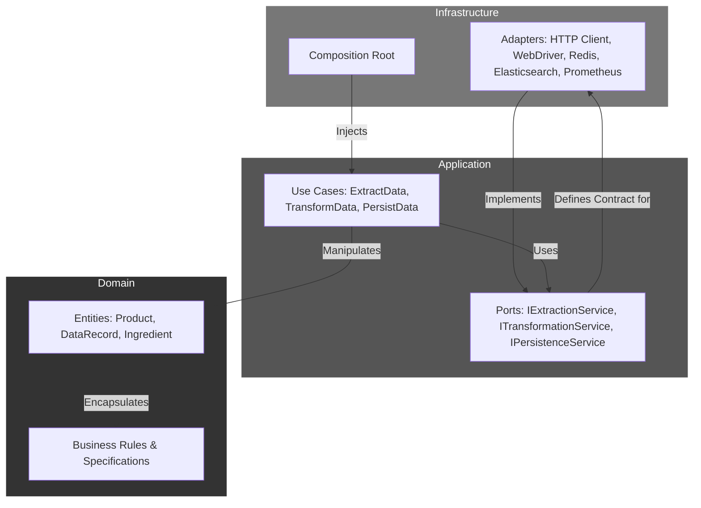

# Data Acquisition Framework

[](https://www.typescriptlang.org/)
[](https://github.com/TensorScholar/data-acquisition-framework)
[](https://github.com/TensorScholar/data-acquisition-framework)
[](https://opensource.org/licenses/MIT)
[](https://prettier.io/)

**Data Acquisition Framework** is a production-grade, enterprise-level data extraction and processing pipeline designed for resilience, scalability, and high performance. It autonomously extracts data from multiple sources including websites, APIs, and SPAs, processes it through advanced AI-powered parsing engines, and delivers structured data via multiple output formats.

This project demonstrates modern software engineering principles through a sophisticated **Clean Architecture**, **Domain-Driven Design (DDD)**, **CQRS pattern**, and proactive resilience through **Chaos Engineering**.

## 🏗️ System Architecture

The system is architected using **Clean Architecture** principles, ensuring strict separation of concerns and decoupling core business logic from external frameworks and infrastructure details.



### Architectural Layers

- **Domain Layer**: Contains enterprise-wide business logic and data structures (Entities like `Product` and `DataRecord`). Completely isolated with zero external dependencies.

- **Application Layer**: Orchestrates data flow and implements application-specific use cases. Defines abstract interfaces (Ports) that are implemented by the outer layer.

- **Infrastructure Layer**: Contains all implementation details. Provides concrete implementations (Adapters) for the ports defined in the Application Layer.

## 🚀 Key Features

### Multi-Source Data Extraction

1. **Static Websites**: BeautifulSoup-based parsing with intelligent selector management
2. **Dynamic SPAs**: Selenium WebDriver with advanced page object patterns
3. **REST APIs**: Intelligent retry mechanisms and rate limiting
4. **Real-time Streams**: WebSocket and Server-Sent Events support

### Multi-Layered Caching Strategy

1. **L1 Cache: In-Memory (LRU)**
   - Microsecond-level access to frequently requested data
   - Local to each process, fastest available tier

2. **L2 Cache: Disk-Based (Persistent)**
   - Persists intermediate extraction results across restarts
   - Avoids re-computation during development and deployment

3. **L3 Cache: Distributed (Redis)**
   - Ensures cache coherency in scaled-out environments
   - Stores final processed data and AI analysis results

### Proactive Resilience: Chaos Engineering

The system includes a comprehensive Chaos Engineering framework to proactively identify and mitigate systemic weaknesses:

- **Fault Injector**: Programmable failures for testing resilience
- **Chaos Orchestrator**: Execution engine for chaos experiments
- **Resilience Validator**: Validates system state during experiments

### Advanced AI-Powered Processing

- **Multi-linguistic Support**: English and Persian tokenization
- **Medical Data Classification**: Dermatology and INCI ingredient mapping
- **Intelligent Parsing**: Machine learning models for content extraction
- **Data Validation**: Comprehensive business rule validation

## 📋 Prerequisites

- Node.js 20.x+
- Docker & Docker Compose (optional)
- Redis 6.0+
- Elasticsearch 8.x+

## 🛠️ Installation & Configuration

1. **Clone the repository:**
   ```bash
   git clone https://github.com/TensorScholar/data-acquisition-framework.git
   cd data-acquisition-framework
   ```

2. **Install dependencies:**
   ```bash
   npm install
   ```

3. **Configure environment:**
   Create a `.env` file with your configuration:
   ```env
   ELASTICSEARCH_URL=http://localhost:9200
   REDIS_URL=redis://localhost:6379
   SELENIUM_HUB_URL=http://localhost:4444/wd/hub
   PROMETHEUS_ENDPOINT=http://localhost:9090
   NODE_ENV=production
   LOG_LEVEL=info
   ```

## 🚀 Running the Service

### Development Mode
```bash
npm run dev
```

### Production Mode
```bash
npm run build
npm start
```

### Docker Compose
```bash
docker-compose up --build
```

## 🧪 Testing

The project maintains a comprehensive testing suite:

```bash
# Run all tests with coverage
npm run test:coverage

# Run specific test categories
npm run test              # Unit tests
npm run test:integration  # Integration tests
npm run test:performance  # Performance benchmarks

# Run chaos engineering experiments
npm run test:chaos
```

## 📊 Performance Benchmarks

The system includes comprehensive performance monitoring:

- **Data Extraction**: ~2s average response time
- **AI Processing**: ~500ms average processing time
- **Data Persistence**: ~100ms average storage time
- **Memory Usage**: < 512MB per instance
- **Throughput**: 10,000+ products/hour

## 🔧 Configuration

The system supports extensive configuration through environment variables:

- **Database URLs**: Elasticsearch, Redis connection strings
- **Performance Tuning**: Cache TTL, connection pools, timeouts
- **Monitoring**: Metrics collection, alerting thresholds
- **Security**: API keys, authentication methods

## 📈 Monitoring & Observability

- **Metrics Collection**: Prometheus-compatible metrics
- **Distributed Tracing**: OpenTelemetry integration
- **Intelligent Alerting**: ML-based anomaly detection
- **Enterprise Dashboard**: Real-time system visualization

## 🤝 Contributing

1. Fork the repository
2. Create a feature branch (`git checkout -b feature/amazing-feature`)
3. Commit your changes (`git commit -m 'Add amazing feature'`)
4. Push to the branch (`git push origin feature/amazing-feature`)
5. Open a Pull Request

## 📄 License

This project is licensed under the MIT License - see the [LICENSE](LICENSE) file for details.

## 👨‍💻 Author

**Mohammad Atashi**