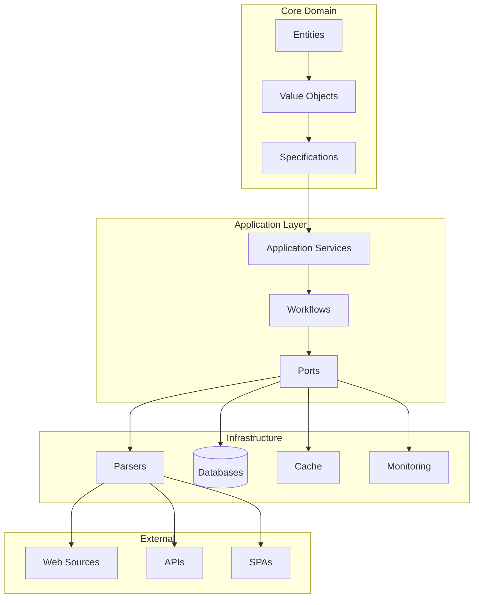

# Data Acquisition Framework

[](https://www.typescriptlang.org/)
[](https://opensource.org/licenses/MIT)
[](https://github.com/TensorScholar/data-acquisition-framework)
[](https://nodejs.org/)

> Enterprise-grade data extraction pipeline built with TypeScript, featuring DDD, CQRS, and comprehensive testing.

## 🏗️ Architecture



## ✨ Key Features

- **Multi-Source Extraction** - Static sites, SPAs, and APIs
- **Advanced Caching** - Multi-level with Redis and in-memory
- **Production Ready** - Docker, Kubernetes, and observability
- **Comprehensive Testing** - Unit, integration, chaos, and mutation tests
- **Functional Core** - Immutable data structures and error handling

## 🚀 Quick Start

### Install
```bash
git clone https://github.com/TensorScholar/data-acquisition-framework.git
cd data-acquisition-framework
npm install
```

### Configure
```bash
cp .env.example .env
# Edit .env with your configuration
```

### Run
```bash
# Development
npm run dev

# Production
npm run build && npm start

# With Docker
docker-compose up -d
```

## 💻 Usage

### Basic Extraction
```typescript
import { ExtractionService } from './src/application/services/extraction.service';

const service = new ExtractionService();
const result = await service.extractFromUrl('https://example.com/product/123');

if (result.isSuccess()) {
  console.log('Product:', result.getValue());
}
```

### Batch Processing
```typescript
import { BatchWorkflow } from './src/application/workflows/batch.workflow';

const workflow = new BatchWorkflow();
const urls = ['https://example.com/product/1', 'https://example.com/product/2'];
const results = await workflow.processBatch(urls);
```

## 🐳 Deployment

### Docker
```bash
docker build -t data-acquisition-framework .
docker run -p 3000:3000 data-acquisition-framework
```

### Kubernetes
```bash
kubectl apply -f k8s/
kubectl get pods -l app=data-acquisition-framework
```

## 🧪 Testing

```bash
npm test              # Unit tests
npm run test:coverage # Coverage report
npm run test:chaos    # Chaos engineering
```

## 📊 Monitoring

Access metrics at `http://localhost:3000/metrics`

- **Extraction Rate** - Products per minute
- **Success Rate** - Successful extractions
- **Error Rate** - Failed extractions
- **Response Time** - Average processing time

## 📁 Project Structure

```
src/
├── core/           # Domain entities & business logic
├── application/    # Use cases & workflows
├── infrastructure/ # External concerns
├── adapters/       # External integrations
└── shared/         # Common utilities
```

## 🤝 Contributing

1. Fork the repository
2. Create a feature branch: `git checkout -b feature/amazing-feature`
3. Commit changes: `git commit -m 'Add amazing feature'`
4. Push to branch: `git push origin feature/amazing-feature`
5. Open a Pull Request

## 📄 License

MIT License - see [LICENSE](LICENSE) for details.

---

## 👨‍💻 Author & Programmer

**Mohammad Atashi**

---

<div align="center">

**Built with ❤️ by Mohammad Atashi**

[⭐ Star this repo](https://github.com/TensorScholar/data-acquisition-framework) | [🐛 Report Bug](https://github.com/TensorScholar/data-acquisition-framework/issues) | [💡 Request Feature](https://github.com/TensorScholar/data-acquisition-framework/issues)

</div>